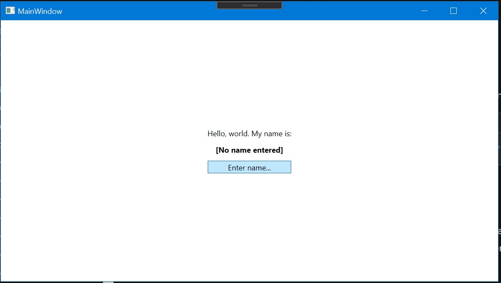
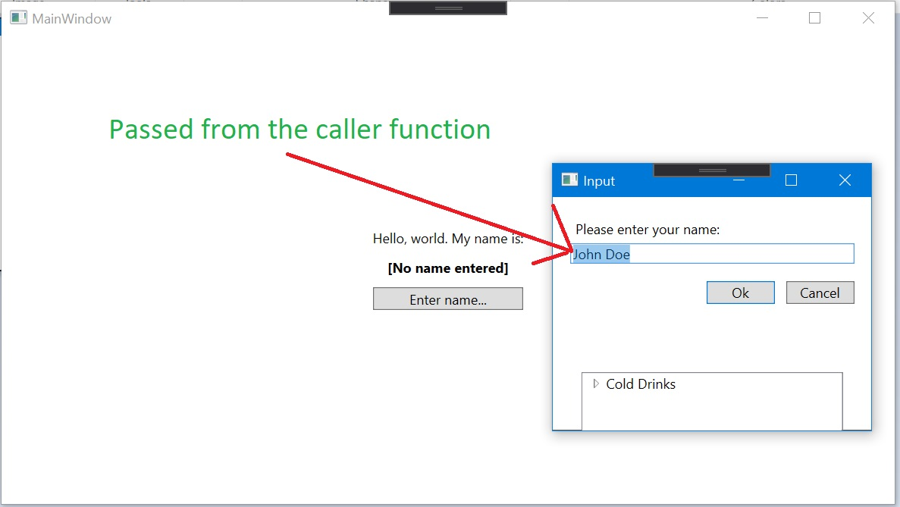
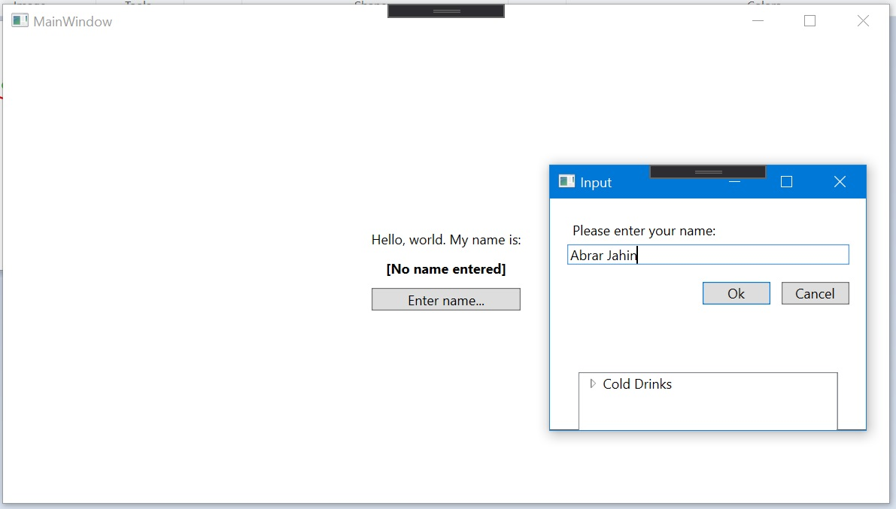
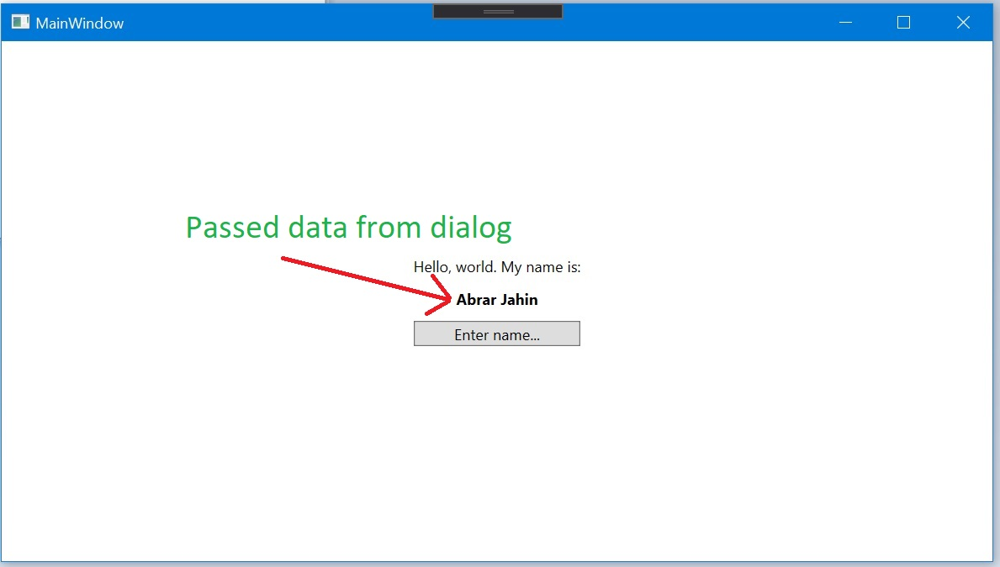

# Wpf Custom Input Dialog with 2 way data binding

This is a demo WPF app developed with ASP.Net Core where a custom dialog is implemented and takes data from the caller, uses the data in the dialog and returns some data from the dialog to the calling function. It is the smallest example for customizing a dialog in WPF. The dialog is implemented with window with XAML, so the view of the dialog can be set to anything you want. And the data needed to pass can be anything set in the constructor of the dialog window (`SignatureViewer` for this case). And returned data from the dialog can also be customised by using any variable like `Answer` in the `SignatureViewer`. Actually, the whole object can be accessed from the caller function (can be in any view or any class or service).

The current view is like-

1. Open Dialog by clicking the `Enter Name` button-

2. Dialog showing passed data from the caller-

3. Dialog taking new data-

4. Dialog passing the data from dialog to caller-

It is the smallest and easiest way for using dialog in WPF.